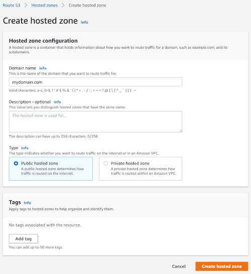

# Tanzu Kubernetes Grid Starter Kit

This projects includes a set of Terraform scripts to provision a
[Tanzu Kubernetes Grid](https://tanzu.vmware.com/kubernetes-grid) cluster
with a bunch of core services:

- [Let's Encrypt](https://letsencrypt.org) certificate generation with [cert-manager](https://cert-manager.io)
- [Contour](https://projectcontour.io) (ingress controller)
- [External-DNS](https://github.com/kubernetes-sigs/external-dns) with [AWS Route 53](https://aws.amazon.com/route53/) integration (expose your Kubernetes services/ingresses as DNS records)

You can also deploy optional services:
- [Harbor](https://goharbor.io) (OCI-compatible registry)
- [Kubeapps](https://kubeapps.com) (a tool for deploying Helm charts)
- [Concourse](https://concourse-ci.org)
- [Jenkins](https://www.jenkins.io)
- [kpack](https://github.com/pivotal/kpack) (a kubernetes [Cloud Native Buildpacks CNB](https://buildpacks.io/))

Using these Terraform scripts, you can deploy those services to your TKG cluster in a matter of minutes.

**Please note this project is not for production use!**

This implementation is designed to work with
[Tanzu Mission Control](https://tanzu.vmware.com/mission-control) managed clusters
using AWS as a provisioner.

## How to use it?

### Setting up your cluster

Create a TKG cluster from TMC. For best results, use at least 3 worker nodes.

As some of the services you're about to deploy use privileged containers,
you need to run this command for your cluster in order to enable this feature:

```bash
$ kubectl create clusterrolebinding privileged-cluster-role-binding --clusterrole=vmware-system-tmc-psp-privileged --group=system:authenticated
```

### Creating a Route 53 hosted zone

You need to create a public
[Route 53 hosted zone](https://console.aws.amazon.com/route53/v2/hostedzones#CreateHostedZone):
this zone will be used by cert-manager and External-DNS to register DNS records for your domain.



Then, make sure you configure your DNS registrar using the `NS` records from your Route 53 hosted zone.

## Configuring Terraform

Create file `terraform.tfvars` using `terraform.tfvars.template`.
Edit this file accordingly:

```yaml
# Set AWS credentials.
aws_access_key = "fake_XXXXXXXXXXXXXXXXXXXX"
aws_secret_key = "fake_XXXXXXXXXXXXXXXXXXXXXXXXXXXXXXXXXXXXXXXX"

# Set the domain you want to use.
# This must be a domain you own: remind that you have to create
# a route53 hosted zone first though.
domain = "mydomain.com"

# Set Let's Encrypt configuration.
# Don't enable production until your deployment is working as expected,
# or you will face issues with certificate generation limits.
letsencrypt_issuer_email = "johndoe@mydomain.com"
letsencrypt_prod         = false

# Set Docker Hub credentials.
# These credentials are used to workaround Docker Hub limits
# when it comes to image pulling.
dockerhub_user     = "johndoe"
dockerhub_password = "whoami"
```

Get your AWS credentials from your AWS console
([My security credentials](https://console.aws.amazon.com/iam/home#/security_credentials)).
Create an access key, and record the secret key.

You're ready to start terraformation!

## Running Terraform

You're used to run Terraform to provision environments: nothing special here.

Create file `modules.tf` using `modules.tf.template`.
You may edit this file to enable / disable modules.

Initialize Terraform and its plugins:

```bash
$ terraform init
```

Check everything is correct:

```bash
$ terraform plan
```

And you're ready to go:

```bash
$ terraform apply
```

This process takes about 5 minutes.

There are some properties which are generated as part of the Terraform process (such as random passwords).
Use this command to display these properties:

```bash
$ terraform output
```

Enjoy!

## Contribute

Contributions are always welcome!

Feel free to open issues & send PR.

## License

Copyright &copy; 2021 [VMware, Inc. or its affiliates](https://vmware.com).

This project is licensed under the [Apache Software License version 2.0](https://www.apache.org/licenses/LICENSE-2.0).
